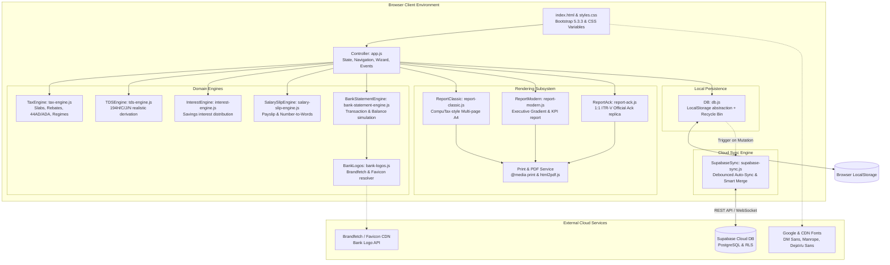
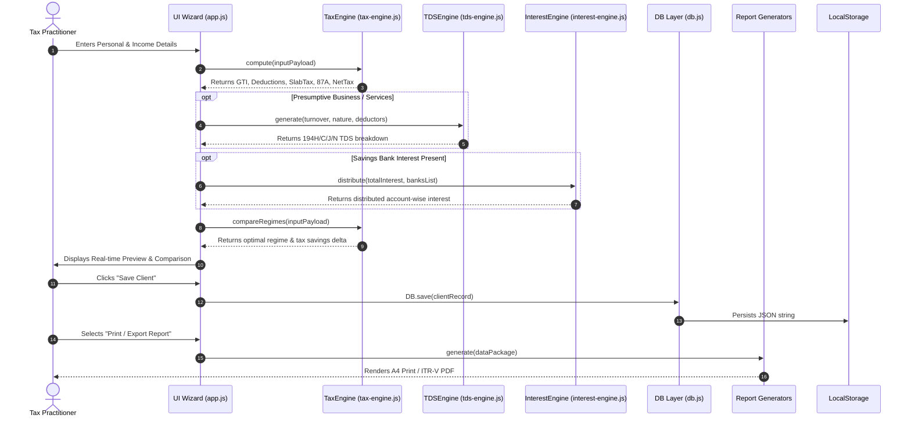

# System Architecture & Technical Specification
## SS INFOTECH – Tax Computation Pro

**Document Version:** 1.0.0  
**Architectural Style:** Offline-First Modular Single Page Application (SPA) + Optional Cloud BaaS  
**Primary Language:** Vanilla JavaScript (ES6+ IIFE / Module Pattern)  
**Target Platform:** Modern Web Browsers (Chromium, Firefox, Safari, WebKit)  

---

### 1. High-Level Architecture Overview

**SS INFOTECH – Tax Computation Pro** is architected as a zero-latency, offline-first client-side web application. It eliminates backend compute dependencies for its primary operations, executing all financial calculations, report rendering, data storage, and PDF generation directly within the client's browser runtime.

For multi-device synchronization and practice backups, the application interfaces with **Supabase (PostgreSQL BaaS)** via asynchronous REST calls, providing seamless cloud snapshotting without compromising local speed or privacy.



---

### 2. Component Decomposition & Responsibilities

#### 2.1 Presentation Layer (`index.html`, `css/styles.css`)
- **Structure (`index.html`):** Single Page Application structure divided into modular `<section class="page">` elements:
  - `#page-dashboard`: Practice dashboard featuring KPI metric counters, Assessment Year breakdown, and quick action shortcuts.
  - `#page-new-computation`: 5-step interactive wizard for personal details, business income, banking, income heads, and live preview.
  - `#page-clients`: Client management table with search, duplicate, CSV export, active client view, and Recycle Bin tab.
  - `#page-salary-slip`: Corporate salary slip generator with company selection, employee master, earnings/deductions, and batch generation.
  - `#page-bank-statement`: Bank statement studio with bank selector, persona simulator, transaction ledger, and print generator.
  - `#page-admin`: Master settings for office branding, signatory credentials, AY tax slabs, custom deductors, and storage analytics.
- **Styling Architecture (`css/styles.css`):**
  - Built upon **Bootstrap 5.3.3** CSS framework.
  - Comprehensive CSS custom property (`:root` / `[data-theme="dark"]`) token system controlling colors, surfaces, borders, elevations, and typography.
  - Dedicated `@media print` rules enforcing strict A4 pagination, hiding sidebar/topbar chrome, removing browser margins, and handling page breaks (`break-before: page`, `page-break-inside: avoid`).

#### 2.2 Application Controller (`js/app.js`)
- **Design Pattern:** Module Pattern / Model-View-Controller (MVC).
- **Core Responsibilities:**
  - **State Management:** Manages active route, current wizard step, selected client IDs, active filters, and edit buffers.
  - **DOM Orchestration:** Binds interactive events, tabs, modal dialogs, and toast notifications.
  - **Input Normalization:** Auto-converts PAN, IFSC, TAN, and transaction IDs to uppercase on the fly without breaking cursor position.
  - **Keyboard Accelerators:** Captures global keybindings (Alt+N for New Computation, Alt+C for Clients, Alt+S for Salary Slip, Alt+B for Bank Statement, Alt+A for Admin, Escape to dismiss modals).
  - **External Ingestion:** Parses official Income Tax Department AIS / 26AS JSON documents and maps fields directly to wizard inputs.

#### 2.3 Computation & Domain Engines

##### 2.3.1 Tax Engine (`js/tax-engine.js`)
- **Module Structure:** Pure functional mathematical engine encapsulated in an IIFE.
- **Statutory Rules Matrix:** Stores slab boundaries, surcharge thresholds, cess rates, standard deductions, and capital gains rates for AY 2023-24, AY 2024-25, AY 2025-26, and AY 2026-27.
- **Algorithm Flow:**
  $$\text{Net Salary} = \max(0, \text{Gross Salary} - \text{Std Deduction} - \text{PTax} - \text{HRA})$$
  $$\text{GTI} = \text{Net Salary} + \text{Business Income} + \text{Interest} + \text{STCG} + \text{LTCG} + \text{Trading P\&L}$$
  $$\text{Taxable Income} = \text{Round}_{10}(\max(0, \text{GTI} - \text{Total Deductions})) \quad \text{[u/s 288A]}$$
  $$\text{Tax Before Rebate} = \text{SlabTax}(\text{Regular Income}) + (\text{STCG} \times R_{\text{stcg}}) + (\max(0, \text{LTCG} - E_{\text{ltcg}}) \times R_{\text{ltcg}})$$
  $$\text{Tax Payable} = \text{Round}_{10}(\max(0, \text{Tax Before Rebate} - \text{Rebate 87A}) \times 1.04) \quad \text{[u/s 288B]}$$
- **Live Comparator (`compareRegimes`):** Simultaneously computes New and Old regimes for the identical input object, calculating the delta and outputting an objective recommendation.

##### 2.3.2 TDS Engine (`js/tds-engine.js`)
- Mathematically derives realistic TDS credits from turnover using industry-specific parameters.
- Allocates deductor entries across Section 194H (Payment gateways), Section 194C (Logistics), Section 194J (Professional), and Section 194N (Cash withdrawals).
- Dynamically assigns valid deductor TANs, distributes transaction dates across financial quarters, and calculates statutory gross bases.

##### 2.3.3 Interest Engine (`js/interest-engine.js`)
- Analyzes the client's bank accounts array.
- Filters out Current Accounts (CA) to assign zero interest.
- Applies a randomized weighting distribution algorithm across Savings Bank (SB) accounts to ensure realistic, natural-looking allocations while maintaining strict rupee reconciliation to the total savings interest figure.

##### 2.3.4 Salary Slip Engine (`js/salary-slip-engine.js`)
- Renders corporate payslip markup matching formal payroll standards.
- Integrates an Indian English Number-to-Words converter (`_numToWords`) parsing numbers into Crores, Lakhs, Thousands, Hundreds, and Rupees.
- Calculates attendance deductions, earnings summation, statutory contributions (PF @ 12%, ESI @ 0.75%, PTax slabs), and net payable figures.

##### 2.3.5 Bank Statement Engine (`js/bank-statement-engine.js` & `js/bank-logos.js`)
- **Format Dispatch Architecture:**
  - **Default Format:** ICICI Bank Detailed Statement (`_generateICICIStatement`), reproducing a 9-column ledger with ICICI metadata cards, advanced search criteria box, and 30-point official transaction legends.
  - **Optional Formats:**
    - **Axis Bank Statement (`_generateAxisStatement`):** Exact PDF replica featuring centered Burgundy vector branding, 2-column customer/KYC metadata grid, 7-column ledger (`Tran Date`, `Chq No`, `Particulars`, `Debit`, `Credit`, `Balance`, `Init. Br`), opening/closing balances, transaction totals, regulatory disclaimers, Registered/Branch office blocks, and official 15-point legends.
    - **State Bank of India (`_generateSBIStatement`):** Authentic SBI format with CIF number, branch details, and SBI ledger rules.
    - **HDFC Bank (`_generateHDFCStatement`):** Classic HDFC corporate statement layout.
    - **Standard Modern Statement (`_generateStandardStatement`):** Neutral, modern grid layout suitable for cooperative and regional rural banks.
- **Simulates Complete Bank Ledgers:** Over 30 Indian scheduled commercial and payments banks supported.
- **Transaction Generation & Chronological Balancing:** Generates authentic UPI transaction IDs, IMPS RRNs, NEFT UTR numbers, and POS terminal narrations while enforcing strict chronological running balances.
- **Resolves High-Resolution Bank Logos:** Tri-tier resolution through `bank-logos.js` (Local assets &rarr; Brandfetch API &rarr; Google Favicon service).

#### 2.4 Document Rendering Subsystems
- **CompuTax Classic (`js/report-classic.js`):** Generates structured tabular A4 output in Times New Roman, complete with formal audit annexures, ledger lines, and office verification seals.
- **Modern Executive (`js/report-modern.js`):** Produces high-resolution, color-coded executive briefs featuring modern typography (DM Sans / Manrope), summary metrics, and visual status cards.
- **Official ITR Acknowledgement (`js/report-ack.js`):** 100% pixel-perfect recreation of the Income Tax Department ITR-V form. Features exact official styling, DejaVu Sans font rendering, official background watermark, simulated 2D barcode, and statutory verification warnings, strictly calibrated for single-page A4 output.
- **Export Drivers:** Direct printing via browser print dialog (`window.print()`) targeting `@media print` rules, or single-click client-side PDF rasterization using `html2pdf.js`.

#### 2.5 Data Persistence & Storage Layer (`js/db.js`)
- **Storage Driver:** Browser `window.localStorage` key-value store.
- **Key Namespace:**
  - `ssinfotech_clients`: Active client computation records array.
  - `ssinfotech_admin`: Office branding, signatory data, custom slabs, and deductors.
  - `ssinfotech_slip_companies`: Registered corporate payroll entities.
  - `ssinfotech_slip_records`: Generated salary slip history.
  - `ssinfotech_statement_records`: Saved bank statement configurations.
- **Fault-Tolerant Operations:**
  - `_safeSetItem`: Try-catch wrapper trapping `QuotaExceededError` (Error code 22 / 1014) to prevent data corruption.
  - Automated diagnostic analyzer `getStorageUsage()` tracking storage consumption in Bytes, KB, and MB against browser limits.
  - **Soft-Delete Recycle Bin:** Soft-deletes records with a `deletedAt` timestamp instead of immediate deletion, enabling recovery from accidental loss.

#### 2.6 Cloud Synchronization Subsystem (`js/supabase-sync.js`)
- **Client:** `@supabase/supabase-js` v2 initialized with project URL and public anonymous key.
- **Synchronization Logic:**
  - **Debounced Auto-Sync:** Listens to `DB` mutation events and queues an automatic cloud push with a 2-second debounce timer.
  - **Safety Guard:** Verifies local record counts before auto-pushing; empty workspaces are strictly blocked from pushing to prevent overwriting cloud history.
  - **Startup Auto-Restore:** Detects if a user opens the application on a fresh device with empty local storage and automatically pulls down the latest valid cloud snapshot.
  - **Smart Merge Engine:** Reconciles differences between cloud snapshots and local data using entity identifiers (`id` or `PAN + AY`) and timestamp comparisons (`updatedAt`), preserving newer edits without data loss.

---

### 3. Data Flow & Transaction Lifecycles

#### 3.1 Computation Pipeline


#### 3.2 Cloud Sync & Smart Merge Lifecycle
```mermaid
sequenceDiagram
    autonumber
    participant Local as Browser LocalStorage
    participant DB as DB Layer (db.js)
    participant SSync as SupabaseSync (supabase-sync.js)
    participant Cloud as Supabase Cloud DB

    Note over Local,DB: User modifies or adds client record
    DB->>Local: Writes updated JSON
    DB->>SSync: triggerAutoBackup("Auto Sync")
    Note over SSync: Debounce timer waits 2000ms

    SSync->>SSync: collectAllData()
    alt Workspace is Empty
        SSync-->>SSync: Halt auto-sync (Protect cloud backup)
    else Workspace has records
        SSync->>Cloud: INSERT into ssinfotech_backups (payload)
        Cloud-->>SSync: 201 Created (Snapshot UUID)
        SSync->>Local: Updates lastSyncAt timestamp
    end

    Note over Cloud,SSync: User on second device clicks "Merge Latest"
    SSync->>Cloud: SELECT latest valid backup
    Cloud-->>SSync: Returns backup JSON payload
    SSync->>SSync: _mergePayloadIntoLocalStorage(payload)
    Note over SSync: Matches by ID or PAN+AY; preserves newer updatedAt
    SSync->>Local: Overwrites merged collections
    SSync->>DB: Triggers UI reload
```

---

### 4. Data Models & Entity Schemas

#### 4.1 Client Entity (`ssinfotech_clients`)
```typescript
interface ClientRecord {
  id: string;                    // Base36 unique identifier
  compNo: string;                // Computation No: CMP-YYYY-NNNNNN
  ackNo: string;                 // 15-digit ITR Ack Number
  ay: string;                    // Assessment Year (e.g., '2026-27')
  name: string;                  // Full Assessee Name (Uppercase)
  father: string;                // Father's Name (Uppercase)
  pan: string;                   // 10-char PAN (Uppercase)
  dob: string;                   // YYYY-MM-DD
  gender: 'Male' | 'Female' | 'Other';
  status: 'Individual' | 'HUF' | 'Firm' | 'Company';
  residentialStatus: 'Resident' | 'Non-Resident' | 'RNOR';
  filing: '139(1)' | '139(4)' | '139(5)' | '119(2)(b)';
  filingDate?: string;           // YYYY-MM-DD
  mobile: string;
  email: string;
  address: {
    door: string;
    premise: string;
    street: string;
    area: string;
    city: string;
    state: string;
    pin: string;
  };
  banks: Array<{
    id: string;
    name: string;
    accountNo: string;
    ifsc: string;
    type: 'SB' | 'CA';
    isRefund: boolean;
    interest?: number;
  }>;
  presumptiveSection: '44AD' | '44ADA' | 'none';
  nature?: string;               // Nature of business
  turnover?: number;
  profitPct?: number;
  computation: ComputationResult;
  balanceSheet?: {
    sundryDebtors: number;
    sundryCreditors: number;
    stockInTrade: number;
    cashBalance: number;
    capital: number;
  };
  createdAt: number;             // Epoch milliseconds
  updatedAt: number;             // Epoch milliseconds
  deletedAt?: number | null;     // Epoch milliseconds (Recycle Bin)
}
```

#### 4.2 Computation Result Entity (`ComputationResult`)
```typescript
interface ComputationResult {
  businessIncome: number;
  savingsInterest: number;
  stcg: number;
  ltcg: number;
  pl: number;
  salaryGross: number;
  salaryStdDeduction: number;
  salaryPtax: number;
  salaryHraExemption: number;
  netSalary: number;
  grossTotalIncome: number;
  deduction80C: number;
  deduction80D: number;
  deduction80CCD1B: number;
  deduction80G: number;
  deduction80TTA: number;
  totalDeductions: number;
  totalIncomeBeforeRounding: number;
  totalIncome: number;           // Rounded u/s 288A
  roundOffAmt: number;
  regularIncome: number;
  taxOnRegular: number;
  taxOnSTCG: number;
  taxableLTCG: number;
  taxOnLTCG: number;
  taxBeforeRebate: number;
  rebate: number;                // Rebate u/s 87A
  taxAfterRebate: number;
  cess: number;                  // 4% Health & Education Cess
  totalTaxPayable: number;       // Rounded u/s 288B
  tdsCredit: number;
  netTax: number;
  refund: number;
  taxDue: number;
  cfg: AssessmentYearConfig;
}
```

#### 4.3 Supabase Cloud Backup Table (`ssinfotech_backups`)
```sql
CREATE TABLE public.ssinfotech_backups (
    id UUID PRIMARY KEY DEFAULT gen_random_uuid(),
    label TEXT NOT NULL DEFAULT 'Manual Backup',
    device_id TEXT,
    client_count INT DEFAULT 0,
    statement_count INT DEFAULT 0,
    slip_count INT DEFAULT 0,
    company_count INT DEFAULT 0,
    data JSONB NOT NULL,
    created_at TIMESTAMPTZ DEFAULT timezone('utc'::text, now()) NOT NULL
);

CREATE INDEX idx_ssinfotech_backups_created_at 
ON public.ssinfotech_backups(created_at DESC);

ALTER TABLE public.ssinfotech_backups ENABLE ROW LEVEL SECURITY;

CREATE POLICY "Allow anon all on ssinfotech_backups" 
ON public.ssinfotech_backups 
FOR ALL 
TO anon 
USING (true) 
WITH CHECK (true);
```

---

### 5. Security, Privacy & Integrity Model

1. **Client-Side Isolation:** Sensitive financial data (PAN, bank accounts, income streams) is strictly stored in the user's browser `localStorage` by default. No background telemetry or analytics scripts are loaded.
2. **Supabase Row Level Security (RLS):** Supabase integration operates using public anonymous keys (`anonKey`) restricted strictly to the configured backup table.
3. **Storage Quota & Data Corruption Safeguards:** Local writes are wrapped with quota handlers. When approaching the 5MB browser quota, the system warns the user, provides a single-click JSON download, and blocks unhandled exceptions.
4. **Input Sanitization:** All report engines use HTML escaping helpers (`_esc`) to neutralize XSS vulnerabilities when rendering dynamic client inputs into the print DOM.

---

### 6. Deployment & Infrastructure

- **Zero-Build Static Distribution:** The application requires no npm build step, webpack, or compiler. It runs natively as static HTML/CSS/JS served over any standard web server (Nginx, Apache, GitHub Pages, Cloudflare Pages, Vercel).
- **CDN Dependencies:**
  - Bootstrap 5.3.3 (`cdn.jsdelivr.net`)
  - Bootstrap Icons 1.11.3 (`cdn.jsdelivr.net`)
  - Chart.js 4.4.2 (`cdn.jsdelivr.net`)
  - html2pdf.js 0.10.1 (`cdnjs.cloudflare.com`)
  - Supabase JS Client v2 (`cdn.jsdelivr.net`)
  - Google Fonts & DejaVu Sans (`fonts.googleapis.com`, `fonts.cdnfonts.com`)
- **Offline Self-Containment:** All logic engines (`tax-engine.js`, `tds-engine.js`, etc.) and fallback IFSC dictionaries are bundled locally, enabling operation in air-gapped office environments.
